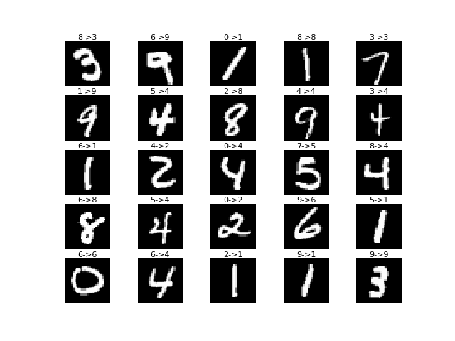

# Noisy-Labels-Neural-Network
Chainer implementation of "Training Deep Neural-Networks Based on Unreliable Labels."
Note that this is not an official implementation of the paper.

Training of the network runs by

```bash
$ python train.py
```

The result of relabeling noisy training data would look like below.


# Reference

[1] Bekker, Alan Joseph, and Jacob Goldberger. "Training deep neural-networks based on unreliable labels." Acoustics, Speech and Signal Processing (ICASSP), 2016 IEEE International Conference on. IEEE, 2016.
